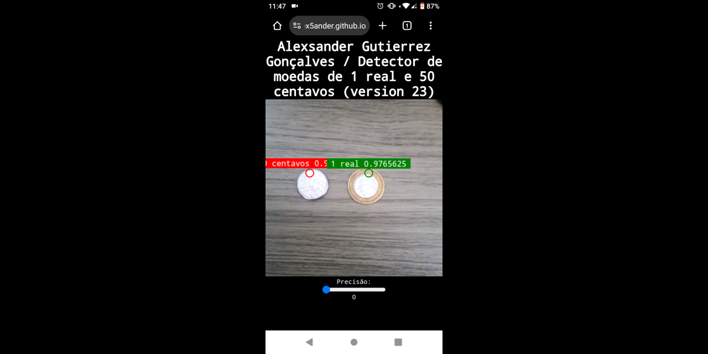

# Detector de moedas de 1 real e 50 centavos utilizando a plataforma [Edge Impulse](https://edgeimpulse.com/).



### Para começar abra o terminal ou o prompt de comando.

### Clone esse repositório

```
git clone https://github.com/Alex5ander/detector-de-moedas-de-1-real-e-50-centavos-wasm.git
```

### Entre na pasta do projeto

```
cd detector-de-moedas-de-1-real-e-50-centavos-wasm
```

### Execute o comando abaixo.

```
npm run dev
```
#### Observação: Os navegadores só permitem acessar a câmera em origem segura, então para contornar isso você vai precisar de um certificado e uma key na raiz do projeto.

E então acesse o url http://localhost:8080 em um navegador para ver a aplicação funcionando.

Caso queira apenas ver a aplicação acesse: [aqui](https://alex5ander.github.io/detector-de-moedas-de-1-real-e-50-centavos-wasm/)
